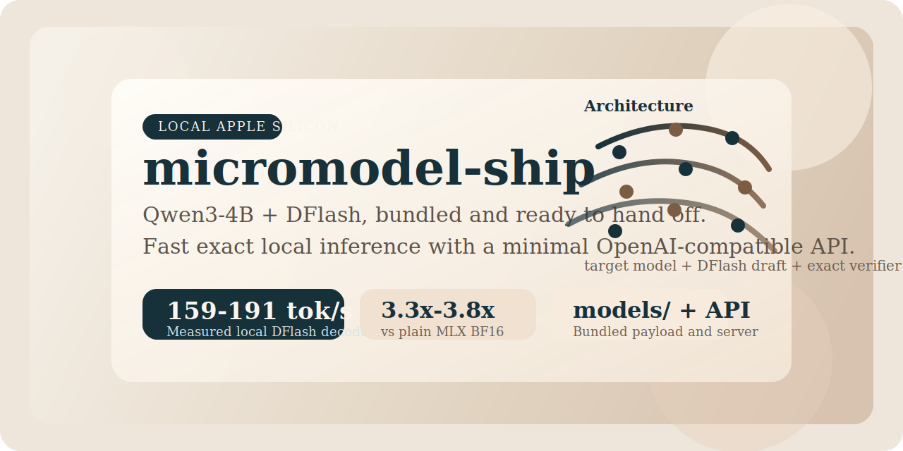
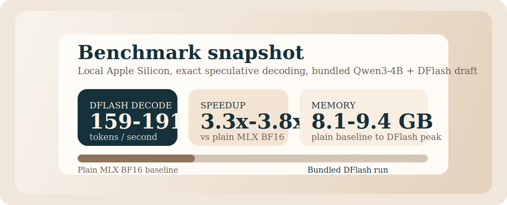
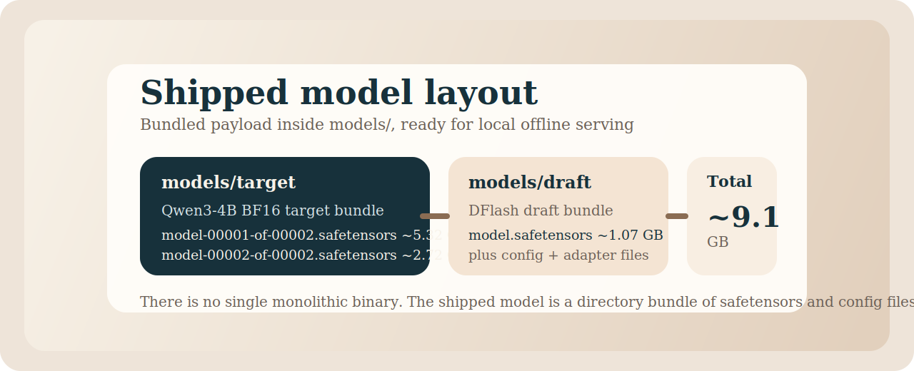

# micromodel-ship



Local Apple Silicon inference bundle for a fast exact Qwen3-4B DFlash model.

> A self-contained GitHub-ready package that ships the runnable runtime, the
> bundled local model payload, a minimal OpenAI-compatible API, and the helper
> scripts needed to demo, benchmark, and release it.

## At a glance

- exact local speculative decoding on Apple Silicon
- bundled target and draft model payloads under `models/`
- minimal OpenAI-compatible API for local tools and apps
- measured `3.3x` to `3.8x` speedup over plain MLX BF16 on this machine
- packaged for GitHub with explicit Git LFS rules for model payloads

## Why this exists

`micromodel-ship` turns a working local research runtime into something you can
actually hand off.

It bundles:

- a real local model payload under `models/`
- a one-command local runner
- interactive chat
- a minimal OpenAI-compatible `POST /v1/chat/completions` server
- repeatable benchmark scripts
- a release flow that is explicit about GitHub and Git LFS

## Performance snapshot



Measured locally on:

- hardware: `Apple M5 Max`
- OS: `macOS 26.4`
- target: `mlx-community/Qwen3-4B-bf16`
- draft: `z-lab/Qwen3-4B-DFlash-b16`
- verifier mode: `parallel-replay`
- prompt length: `101` input tokens

| Max new tokens | Runtime | Generation tok/s | End-to-end tok/s | Peak memory |
|---:|---|---:|---:|---:|
| 512 | Plain MLX-LM BF16 | 55.13 | 48.67 | 8.18 GB |
| 512 | DFlash BF16 | 190.73 | 186.89 | 9.33 GB |
| 1024 | Plain MLX-LM BF16 | 48.18 | 44.05 | 8.28 GB |
| 1024 | DFlash BF16 | 159.35 | 157.98 | 9.43 GB |

Observed speedup:

- `3.46x` decode speedup at `512` tokens
- `3.84x` end-to-end speedup at `512` tokens
- `3.31x` decode speedup at `1024` tokens
- `3.59x` end-to-end speedup at `1024` tokens

More detail is in [PERFORMANCE.md](PERFORMANCE.md).

## What ships in this repo

```text
micromodel-ship/
  pyproject.toml
  README.md
  PERFORMANCE.md
  RELEASE.md
  .gitattributes
  shipmodel
  micromodel_ship/
    cli.py
    config.py
    runtime.py
    server.py
  scripts/
    run.sh
    chat.sh
    serve.sh
    stop.sh
    status.sh
    bench.sh
    prefetch.sh
    paths.sh
    package.sh
    check-no-secrets.sh
  models/
    target/
    draft/
  metrics/
  dist/
```

## Where the model binary is

There is no single monolithic “model binary.”



The shipped model payload is split across files inside these bundled
directories:

- target model bundle: `models/target/`
- DFlash draft bundle: `models/draft/`

Those directories are the repo-local payload that this package prefers at
runtime.

## Quick start

```bash
cd ~/dev/models/micromodel-ship
uv sync
./scripts/serve.sh
```

Health check:

```bash
curl http://127.0.0.1:8051/healthz
```

Metrics check:

```bash
curl http://127.0.0.1:8051/metrics
```

OpenAI-compatible request:

```bash
curl http://127.0.0.1:8051/v1/chat/completions \
  -H 'Content-Type: application/json' \
  -d '{
    "model": "micromodel-qwen3-4b-dflash",
    "messages": [
      {"role": "user", "content": "Write a Go HTTP server with a /health endpoint."}
    ],
    "max_tokens": 256,
    "temperature": 0
  }'
```

## Included scripts

```text
scripts/run.sh               # one-shot generation
scripts/chat.sh              # interactive chat
scripts/serve.sh             # local API server
scripts/stop.sh              # stop the local API server by port
scripts/status.sh            # show server status and health
scripts/bench.sh             # plain MLX + DFlash benchmark and metrics capture
scripts/prefetch.sh          # refresh bundled target + draft from upstream
scripts/paths.sh             # show resolved target + draft paths
scripts/package.sh           # build offline tarball
scripts/publish-hf.sh        # build (if needed) and upload tarball + model card to Hugging Face
scripts/check-no-secrets.sh  # scan repo text files for common secret material
```

Examples:

```bash
./scripts/run.sh "Explain speculative decoding simply."
./scripts/chat.sh
./scripts/serve.sh
./scripts/stop.sh
./scripts/status.sh
./scripts/bench.sh "Write a Go HTTP server with a /health endpoint."
./scripts/paths.sh
./scripts/check-no-secrets.sh
```

## API surface

Supported endpoints:

- `GET /healthz`
- `GET /v1/models`
- `GET /metrics`
- `POST /v1/chat/completions`

Notes:

- the API is intentionally minimal
- the server runs a single in-process model instance
- generation is serialized through that instance for correctness and simplicity
- HTTP binds before the model warms; `/healthz` returns `503 {"status":"warming"}`
  until the model is loaded, then `200 {"status":"ready"}`. `/v1/chat/completions`
  returns 503 until warmup completes

### Auth and bind

By default the server is unauthenticated and binds `127.0.0.1:8051`. To require
a bearer token on `/v1/chat/completions` and `/metrics` (public endpoints
`/healthz` and `/v1/models` stay open for supervisor probes):

```bash
export FLOCODE_SERVE_TOKEN=$(openssl rand -hex 32)
./scripts/serve.sh
# or:
uv run micromodel-ship serve --bind 127.0.0.1:8051 --no-hf-fallback
```

Pass the token via `Authorization: Bearer <token>`. An empty token (unset env)
disables auth entirely. See [capabilities.json](capabilities.json) for the
machine-readable manifest consumed by flocode.

## Distribution

The offline tarball (`dist/micromodel-ship-offline.tar.gz`, ~7GB) is too large
for git and is hosted on Hugging Face:

- [huggingface.co/florianleibert/micromodel-ship](https://huggingface.co/florianleibert/micromodel-ship)

The tarball is gitignored. To rebuild and republish, run:

```bash
./scripts/publish-hf.sh
```

This rebuilds the tarball (if missing) and uploads both it and the HF model
card (`HUGGINGFACE.md`) to the Hub. Requires an HF token at
`~/.accounts/hugginface` (or set `HF_TOKEN_FILE`).

Model payloads under `models/**` are still tracked through Git LFS via
`.gitattributes`.

Before publishing:

1. run `./scripts/check-no-secrets.sh`
2. verify the server with `./scripts/status.sh`
3. rebuild and ship the tarball with `./scripts/publish-hf.sh`
4. read [RELEASE.md](RELEASE.md)

## Notes

- Apple Silicon only
- DFlash is exact speculative decoding, not approximate rewriting
- the runtime prefers bundled `models/target` and `models/draft` automatically
- if those local directories are missing, it can still fall back to upstream model ids

## Release checklist

Before pushing this repo to GitHub:

1. run `./scripts/check-no-secrets.sh`
2. verify the server with `./scripts/status.sh`
3. publish the offline bundle to Hugging Face with `./scripts/publish-hf.sh`
4. confirm Git LFS is enabled for `models/**`
5. read [RELEASE.md](RELEASE.md) and then push
